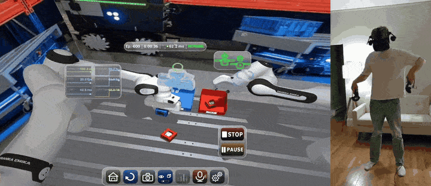
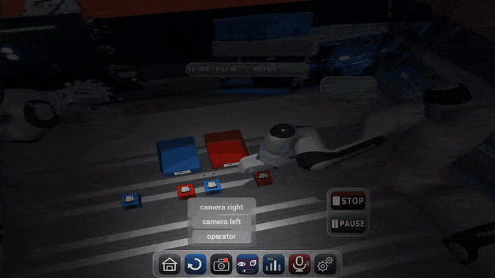
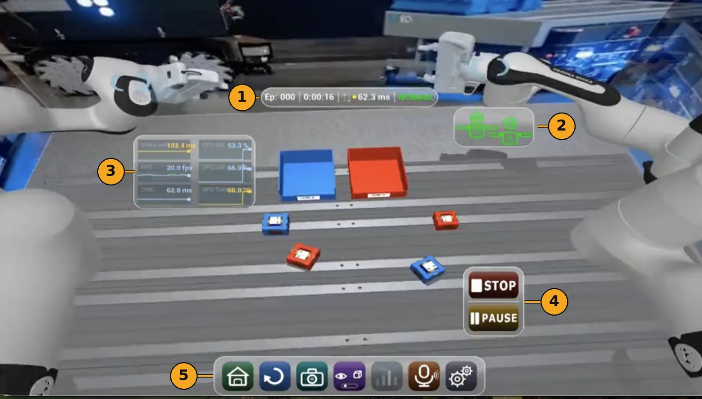
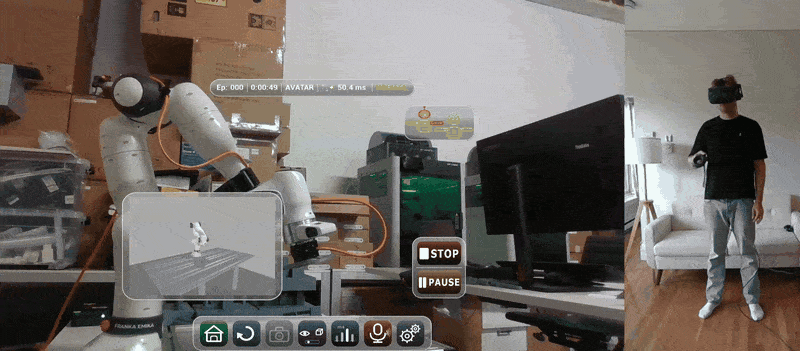

# VR Teleoperation Interface

Immersive bimanual robot teleoperation in Unreal Engine 5.4. An operator wearing an HTC Vive Pro Eye drives two Franka arms and a pan-tilt head over the public internet, sees the robot's cameras as a stereo layer in the headset, and works through a UI driven by gaze and voice — because both hands are already busy holding the robot.

This repository is the **operator side**. The robot-side backend — control loops, MuJoCo simulation, video streamer — lives in [teleop-simulator](https://github.com/AlexanderWegenerRobotics/teleop-simulator).



<sub>Bimanual sorting, both arms driven live. The panel on the right is the operator at the same moment.</sub>

> **Status: active development.** The interface and data pipeline are stable and have been used for cross-continental operation (~11,000 km, Boston ↔ Abu Dhabi) and for demonstration collection. Hardware configurations and the feature set are still evolving.

---

## What this does

An operator wears a VR headset and sees the robot's camera feed rendered as a stereo layer inside Unreal. Controller motion is mapped to end-effector commands and streamed as independent low-latency UDP packets — one per device (left arm, right arm, head, avatar). High-level commands such as resets and mode switches use a separate reliable channel with msgpack serialisation, ACK confirmation and retransmission.

The video path runs GStreamer on the robot side: H.264 at ultra-low-latency settings, RTP over UDP with ULP-FEC redundancy, across a ZeroTier link. Left and right images are packed side by side into a single frame before encoding, so one stream carries both eyes and is synchronised by construction. A 64-bit wall-clock timestamp is embedded in an extra image row, so with both machines disciplined to NTP the receiver measures **true one-way delay at decode time** rather than assuming half a round trip. The receiver decodes on the GPU (`nvh264dec`) where the hardware supports it and falls back to CPU (`avdec_h264`) at runtime where it does not, then feeds frames through a latest-frame queue — stale frames are dropped rather than shown.

Packet loss and jitter are operating conditions on the public internet, not failures. A quality controller on the sender adapts bitrate, frame rate, resolution and FEC level in real time from receiver feedback arriving at 50 Hz, with separate thresholds for degrading and recovering so a loss rate sitting near a boundary does not make the stream flap.

Everything the operator sees and does is logged. Each session writes per-frame telemetry, a command log, an event log, and two recorded MP4 views — the operator's perspective and a gaze-projected attention map — for offline analysis and for training policies on the collected demonstrations.

---

## The interface



**Hands-free by default.** Both hands are on the controllers, so the UI does not ask for them. Widgets are selected by looking at them and dwelling for a configurable time, confirmed with an audio cue; the picture-in-picture camera view grows when the operator looks at it and shrinks when attention returns to the task. A Whisper-based speech module runs in parallel for keyword commands and for annotating a collection session while it is running.

**State you can read at a glance.** Everything the operator needs to judge the link and the robot is in the view, and nothing needs a hand to reach.



1. **Status pill** — episode number, elapsed time, measured one-way latency, video-link state
2. **Device-state graph** — every device on the avatar and where it is in the state machine; red means not yet ready
3. **Metrics panel** — video latency, frame rate, one-way delay, remote CPU/GPU load and temperature
4. **Stop / pause** — always in view, and mirrored on either controller's menu button
5. **Tray** — home, reset, snapshot, overlay toggle, metrics, voice, settings, all selectable by gaze

**A ghost that shows the command, not the past.** A translucent gripper is reprojected into the video through the camera model and shows the pose the operator is currently commanding, before the arm gets there. Its opacity is driven by the gap between commanded and actual pose — the gap opens under fast motion and closes at steady state — and it degrades visibly as measured latency crosses configured thresholds. The overlay, the video layer and gaze projection share one quad geometry on purpose: if those diverge, the ghost slides off the image it annotates.

**Limits you see before you hit them.** A proximity cue lights the workspace faces the end-effector is approaching, with severity driven by time-to-contact rather than distance alone, so a slow deliberate approach stays quiet and a fast one warns early. Hysteresis and attack/release smoothing keep it from flickering.

**Grasp confirmation.** Gripper width and grasp state come back from the avatar and are shown at the hand — open, held, or lost — so a failed grasp is visible immediately rather than at the moment the object is not where it should be.

**Predictive twin.** A second instance of the control stack runs locally on a simulated plant, fed by the same command stream before it reaches the network. Its head-cam feed is registered as a second main-view source, so the operator can switch between the twin — which responds at zero latency — and the real avatar, which trails it by exactly the packet's time in flight.

### On hardware



The same build, the same configs, a real arm on the far end of a ZeroTier link. Everything above — HUD, gaze selection, ghost, recording — behaves identically whether the backend is MuJoCo or libfranka; only `remote_ip` and the scenario configs change.

---

## Running it

### Prerequisites

- **Unreal Engine 5.4** and a matching Visual Studio C++ toolchain (Windows)
- **HTC Vive Pro Eye** with SteamVR, plus the bundled `ViveOpenXR` plugin for HMD, controller and eye-tracking input
- **GStreamer** (development runtime) for the bundled `GStreamerPlugin` receive pipeline
- **ZeroTier** for the LAN-over-internet link to the robot host
- msgpack-c and Eigen are vendored under `ThirdParty/`

### Build

Generate project files for `teleop_vr_interface.uproject` and build the `teleop_vr_interfaceEditor` target, or open the `.uproject` and let the editor compile the module.

### Configure

Point `Config/TeleOp/config.json` at the scenario you want — it is a small index that selects which network, stream, robot and overlay configs to load. Set `remote_ip` in the network and stream configs to the robot host's ZeroTier address. Nothing here needs a recompile; all of it is read at startup.

### Run

Start the robot-side backend first (see [teleop-simulator](https://github.com/AlexanderWegenerRobotics/teleop-simulator)), then launch this project in VR preview or as a packaged build. You are connected when video appears in the headset and the avatar state walks `IDLE → HOMING → AWAITING`; engaging from the tray moves it to `ENGAGED` and the arms begin following the controllers.

### Without a robot

The interface runs against a local preview source and the local network/stream configs, so the UI, HUD, gaze interaction and recording can be exercised on one machine with no Franka and no remote host. Pair it with the simulator repo's MuJoCo backend for a full loop in simulation.

---

## Architecture

| Video pipeline | Full system |
|:--------------:|:-----------:|
|  |  |

### Communication channels

| Channel | Transport | Semantics |
|---------|-----------|-----------|
| Left / right arm command | UDP, per device | Send-and-forget, low latency |
| Head command | UDP, per device | Send-and-forget, low latency |
| Avatar / system state | UDP | Send-and-forget, low latency |
| High-level commands | UDP + msgpack + ACK | Reliable, retransmit up to N times |
| Video | RTP/UDP + ULP-FEC | GStreamer pipeline |
| RTP feedback | UDP @ 50 Hz | Quality controller input |
| Recording control | UDP | Episode start/stop, synchronised with the avatar |

### System state machine

Every device shares one state machine, reflected in each UDP message header:

```
OFFLINE → IDLE → HOMING → AWAITING → ENGAGED ⇌ PAUSED
                                        ↓
                                      FAULT → RECOVERING → AWAITING
                                        ↓
                                       STOP
```

Fault codes surfaced live in the HUD include `JOINT_LIMIT`, `JOINT_LOCKED`, `HIGH_EXT_FORCE`, `VELOCITY_LIMIT`, `IMPLAUSIBLE_CMD`, `COMM_LOSS`, `COLLISION_RISK`, `WORKSPACE_LIMIT`, `INTERNAL_ERROR`, `HMD_NOT_WORN`.

### Controller mapping

| Input | Action |
|-------|--------|
| Trigger (analog) | Clutch — progressively decouples controller motion from the robot, with hysteresis and a haptic cue at the engage and release points |
| Grip button | Grasp |
| Trackpad up / down | Motion scale (gear) step up / down |
| Menu button (either controller) | Emergency stop |
| Gaze dwell | Widget selection, confirmed by an audio cue |
| Voice `"reset all"` | Reset both arms |
| Voice `"annotate …"` | Inject a label into the session event log |

---

## Configuration

All runtime parameters live in `Config/TeleOp/` and are read at startup. `config.json` selects which file fills each role, so switching between scenarios — desk robot, warehouse cell, local-only — is an edit to one small index rather than a diff across every config. The files themselves carry inline comments explaining the non-obvious values; those comments are the reference, not this table.

| Role | What it governs |
|------|-----------------|
| `network` | Robot host address, per-device UDP send/receive ports, recording control port |
| `network_twin` | The same, for the locally running predictive twin |
| `stream` | Video stream ports, stereo mode, picture-in-picture sources, twin video source |
| `hud` | HUD warning thresholds — latency, packet loss, frame-rate floor, entry/exit windows |
| `robot` | Workspace bounds, boundary-cue tuning, wrist pivots, controller→end-effector retargeting |
| `overlay` | Ghost overlay thresholds and opacity, camera viewpoint and FOV, shared quad geometry |

Scenario variants sit beside the defaults (`*_local` for single-machine operation, `*_desk` for the desk-mounted arm) and are selected through `config.json`.

---

## Logging

Each session writes a timestamped folder under `Logs/TeleOp/<YYYYMMDD_HHMMSS>/`:

| File | Contents |
|------|----------|
| `stream.csv` | Per-frame telemetry: device states, controller poses, clutch and gear, grasp and gripper feedback, head command, video and data-link metrics, remote host health |
| `command.csv` | Outgoing commands, logged at the command rate rather than the HUD rate |
| `events.log` | Discrete events: UI interactions, voice annotations, resets, fault transitions |
| `operator_view.mp4` | The operator's perspective as recorded in the headset |
| `attention_view.mp4` | Gaze-projected attention map over the same view |

CSV writing runs on a background thread with buffered flushes, so logging does not stall the render or command loops.

---

## Repository layout

```
Source/teleop_vr_interface/   C++ module — Public/ headers mirror Private/ implementations
  Shared/                     Wire protocol structs and UE-exposed avatar enums
  Networking/                 UDP sockets, per-device streams, reliable command channel
  Teleop/                     Operator pawn, config loading, session logging
  Input/                      Controller pose, clutch and button mapping
  Video/                      Receive and decode, stereo layer, ghost overlay,
                              workspace cue, grasp indicator, gaze projection, recording
  UI/                         Gaze selection, HUD widgets, metric history, voice, audio cues
Config/TeleOp/                Runtime configuration (see above)
Content/                      Maps, materials, widget blueprints, input mappings, sounds
Plugins/                      GStreamerPlugin (video receive), ViveOpenXR (HMD + eye tracking)
ThirdParty/                   msgpack, Eigen
docs/                         Architecture diagrams and interface media
```

---

## Dependencies

| Dependency | Purpose |
|------------|---------|
| Unreal Engine 5.4 | Rendering, VR runtime, game loop |
| HTC Vive Pro Eye + SteamVR | Headset, controllers, eye tracking |
| OpenXR / ViveOpenXR | HMD and controller input, gaze |
| GStreamer (custom UE plugin) | H.264 RTP receive pipeline |
| ZeroTier | LAN-over-internet between robot and operator host |
| msgpack-c | Serialisation for the reliable command channel |
| Eigen | Geometry and pose maths |
| Whisper (STT) | Keyword voice commands and annotation |

---

## License

Apache License 2.0 — see [LICENSE](LICENSE).

## Contact

Alexander Wegener — [Alexander_wegener1998@yahoo.de](mailto:Alexander_wegener1998@yahoo.de)
