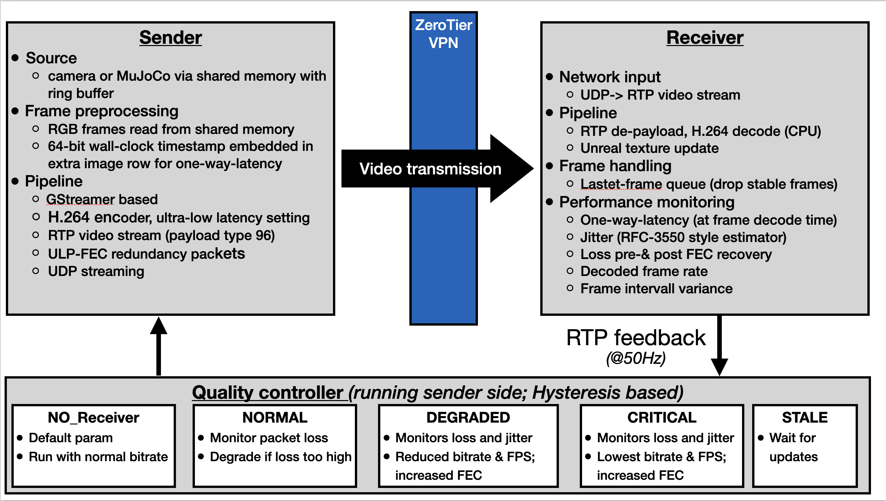
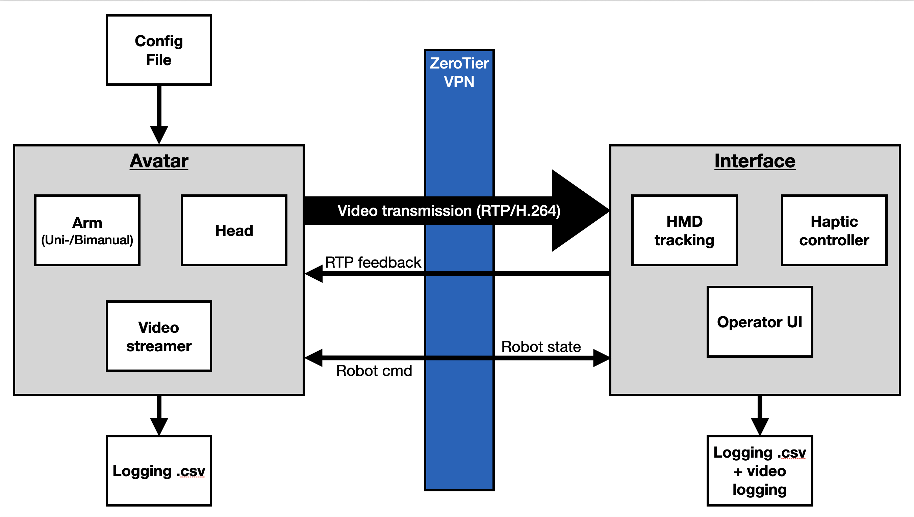

# VR Teleoperation Interface

Immersive bimanual robot teleoperation in Unreal Engine 5.4 with a HTC Vive Pro Eye headset and two HTC handheld controllers. The interface streams live H.264 video from the robot over UDP/RTP with adaptive quality control, exposes a fully hands-free UI driven by eye gaze and speech, and logs every operator action, robot state, and video metric to disk for offline analysis.

> **Status: active development** — core functionality is stable; hardware configurations and feature set are still evolving.
> The robot-side backend (control loops, MuJoCo simulation, video streamer) lives in [teleop-simulator](https://github.com/AlexanderWegenerRobotics/teleop-simulator).

---

## What this does

An operator wears a VR headset and sees the robot's camera feed rendered as a stereo layer inside Unreal. Controller motion is mapped to robot end-effector commands and streamed as independent low-latency UDP packets — one per device (left arm, right arm, head, overall avatar). High-level commands (e.g. arm reset, mode switches) use a separate reliable channel with automatic retransmission and ACK-based confirmation.

The video pipeline runs GStreamer on the robot side, encodes in H.264 at ultra-low latency, embeds a 64-bit wall-clock timestamp and frame ID in each frame for end-to-end latency measurement, and transmits via RTP over UDP with ULP-FEC redundancy. The receiver decodes on CPU, updates an Unreal texture, and feeds the decoded frames through a latest-frame queue (stale frames are dropped). A hysteresis-based quality controller on the sender adapts bitrate, FPS, and FEC level in real time based on RTP feedback arriving at 50 Hz from the receiver.

The HUD displays live operator and avatar state (per-device system state and fault codes), and rolling time-series plots of one-way video latency, jitter, packet loss (pre- and post-FEC), decoded frame rate, and frame-interval variance. The operator interacts with the UI entirely hands-free: gaze-based widget selection triggers actions after a configurable dwell time, confirmed with an audio cue. A Whisper-based STT module runs in parallel for keyword commands to control the UI and annotate data collection sessions at runtime.

During a session the system records two MP4 streams to disk — the standard operator view and a gaze-projected attention-map view — alongside a per-session CSV of the full telemetry and event log.

---

## Demo

**Pick-and-place task — operator view · attention-map view**

| Operator view | Attention map |
|:-------------:|:-------------:|
|  |  |

---

## System diagrams

| Video pipeline | Full system |
|:--------------:|:-----------:|
|  |  |

---

## Communication channels

| Channel | Transport | Semantics |
|---------|-----------|-----------|
| Left arm command | UDP (per-device) | Send-and-forget, low latency |
| Right arm command | UDP (per-device) | Send-and-forget, low latency |
| Head command | UDP (per-device) | Send-and-forget, low latency |
| Avatar / system state | UDP | Send-and-forget, low latency |
| High-level commands | UDP + msgpack + ACK | Reliable, retransmit up to N times |
| Video | RTP/UDP + ULP-FEC | GStreamer pipeline |
| RTP feedback | UDP @ 50 Hz | Quality controller input |

---

## Repository structure

```
teleop_vr_interface/
├── Source/teleop_vr_interface/
│   ├── Public/
│   │   ├── Shared/
│   │   │   ├── protocol.hpp            # Packed binary message structs (arm, head, avatar)
│   │   │   └── AvatarTypes.h           # UE-exposed enums: SysState, FaultCode, DeviceId
│   │   ├── Networking/
│   │   │   ├── UdpSocket.h             # Raw UDP send / async receive
│   │   │   ├── ComLink.h               # Low-latency send-and-forget device streams
│   │   │   ├── CommandLink.h           # Reliable msgpack channel with ACK + retransmit
│   │   │   └── DeviceStream.h          # Per-device stream abstraction
│   │   ├── Teleop/
│   │   │   ├── OperatorPawn.h          # Top-level VR pawn; owns all subsystems
│   │   │   ├── TeleOpConfig.h          # JSON config loader (network, stream, HUD)
│   │   │   └── TeleOpLogger.h          # Session CSV + event log writer
│   │   ├── Input/
│   │   │   └── TrackedControllerComponent.h  # Controller pose + button mapping
│   │   ├── Video/
│   │   │   ├── IVideoSource.h          # Abstract video source interface
│   │   │   ├── GStreamerSource.h       # GStreamer RTP/H.264 receive + timestamp decode
│   │   │   ├── VideoFeedComponent.h    # UE component: texture update + stereo layer
│   │   │   ├── VideoEncoderWrapper.h   # Operator-view MP4 recorder
│   │   │   ├── VideoLogger.h           # Attention-map MP4 recorder
│   │   │   └── GazeProjection.h        # Eye-gaze → video-plane projection
│   │   └── UI/
│   │       ├── GazeComponent.h         # Gaze-based widget selection + dwell detection
│   │       ├── WidgetBinder.h          # Maps gaze hits to HUD actions
│   │       ├── TrayController.h        # Floating UI tray management
│   │       ├── TimeSeriesWidget.h      # Rolling metric plots (latency, FPS, loss …)
│   │       ├── TMetricHistory.h        # Ring-buffer metric storage
│   │       ├── WinkGesture.h           # Wink-based secondary trigger
│   │       └── SoundFeedback.h         # Audio confirmation cues
│   └── Private/                        # Implementations (mirrors Public/ layout)
├── Config/
│   └── TeleOp/
│       ├── config.json                 # Top-level config: points to sub-configs
│       ├── network.json                # Device UDP ports (send / receive per device)
│       ├── stream.json                 # Video stream IP, RTP port, feedback port
│       └── hud.json                    # HUD thresholds (latency, loss, FPS warnings)
├── Content/
│   ├── Input/                          # Input action mappings (grip, trigger, pad)
│   ├── Maps/                           # main_map_black, main_map_light, debug_map
│   ├── Materials/                      # M_VideoFeed (video texture material)
│   ├── Sounds/                         # UI audio cues
│   └── UI/                             # Widget blueprints (debug panel, time-series)
├── Plugins/
│   ├── GStreamerPlugin/                # Custom GStreamer UE5 plugin (video receive)
│   └── ViveOpenXR/                     # HTC Vive Pro Eye OpenXR plugin
├── docs/
│   ├── system_overview_video.png       # Video pipeline diagram
│   ├── system_overview_architecture.png # Full system block diagram
│   └── gifs/
│       ├── pick_and_place_operator.gif  # Operator-view demo clip
│       └── pick_and_place_attention.gif # Attention-map demo clip
└── teleop_vr_interface.uproject
```

---

## Configuration

All runtime parameters are loaded from `Config/TeleOp/` at startup — no recompile needed.

**`network.json`** — device UDP ports

```json
{
    "remote_ip": "10.x.x.x",
    "avatar":    { "send": 7000, "receive": 8000 },
    "arm_left":  { "send": 7001, "receive": 8001 },
    "arm_right": { "send": 7002, "receive": 8002 },
    "head":      { "send": 7003, "receive": 8003 }
}
```

**`stream.json`** — video pipeline ports

```json
{
    "remote_ip":          "10.x.x.x",
    "port":               5004,
    "feedback_port":      5005,
    "timestamp_port":     5006,
    "status_port":        5007,
    "report_interval_ms": 500
}
```

**`hud.json`** — live HUD warning thresholds

```json
{
    "latency_warning_ms":      80.0,
    "loss_warning_percent":    0.001,
    "fps_warning_floor":       20.0,
    "metric_entry_window_s":   5.0,
    "metric_exit_window_s":    3.0,
    "confirmation_duration_s": 3.0
}
```

---

## Controller mapping

| Input | Action |
|-------|--------|
| Trigger (analog) | Grasp command (proportional) |
| Grip button | Clutch — decouple controller motion from robot |
| Trackpad up / down | Gear ratio step up / step down |
| Both controllers + gesture | Reset individual arm |
| STT keyword `"reset all"` | Reset both arms simultaneously |
| STT keyword `"annotate …"` | Inject label into session event log |

---

## Logging

Each session creates a timestamped folder under `Logs/TeleOp/<YYYYMMDD_HHMMSS>/`:

| File | Contents |
|------|----------|
| `stream.csv` | Full telemetry: per-device state, joint positions, controller poses, video metrics, gaze target, gear ratio, clutch state — at the control loop rate |
| `events.log` | Discrete events: UI interactions, STT annotations, arm resets, fault transitions |
| `operator_view.mp4` | Recorded operator perspective (MP4) |
| `attention_view.mp4` | Gaze-projected attention-map video (MP4) |

---

## System state machine

The system follows a shared state machine across all devices, reflected in every UDP message header:

```
OFFLINE → IDLE → HOMING → AWAITING → ENGAGED ⇌ PAUSED
                                        ↓
                                      FAULT → RECOVERING → AWAITING
                                        ↓
                                       STOP
```

Fault codes reported live in the HUD include: `JOINT_LIMIT`, `JOINT_LOCKED`, `HIGH_EXT_FORCE`, `VELOCITY_LIMIT`, `IMPLAUSIBLE_CMD`, `COMM_LOSS`, `COLLISION_RISK`, `WORKSPACE_LIMIT`, `HMD_NOT_WORN`.

---

## Dependencies

| Dependency | Purpose |
|------------|---------|
| Unreal Engine 5.4 | Rendering, VR runtime, game loop |
| HTC Vive Pro Eye + SteamVR | HMD + eye tracking hardware |
| OpenXR / ViveOpenXR plugin | HMD and controller input |
| GStreamer (custom UE plugin) | H.264 RTP receive pipeline |
| ZeroTier VPN | LAN-over-internet between robot and operator PC |
| msgpack-c | Serialisation for reliable command channel |
| Whisper (STT) | Keyword-based voice commands |

---

## Contact

Alexander Wegener — [Alexander_wegener1998@yahoo.de](mailto:Alexander_wegener1998@yahoo.de)
